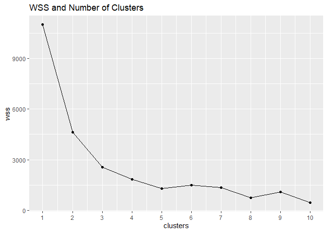

Sexual Health and non-English Language in Chicago, Illinois
================

Nathan Eckert ne4256

## Introduction

The data included in this exploratory analysis are from the official
City of Chicago website. The first data set called Languages Spoken in
Chicago was collected from 2008 to 2012. It includes data about the
predominant non-English language spoken in each Chicago community. It
also includes the percent of residents over five, who speak English
“less than very well” in addition to the counts of the spoken languages.
The data was compiled from U.S. Census Bureau’s 2008-2012 American
Community Survey 5-year estimates. The second data set is named Public
Heath Statistics from 2005 to 2011 and includes various health
indicators organized by community area of Chicago. It was collected from
multiple sources including census data, Chicago Dept. of Public Health,
and reports accessible through local infectious disease laws.

I wanted to investigate these data sets as I was curious if groups of
people who spoke little English, or specific ethnicities were more prone
to specific conditions. I expect that areas with lower education and
less skill with the English language will have more diseases such as
gonorrhea. I also assume that rates of STDs will be correlated with high
rates of pregnancy, suggesting lack of contraceptive use.

*Source URLs*
<https://data.cityofchicago.org/Health-Human-Services/Census-Data-Languages-spoken-in-Chicago-2008-2012/a2fk-ec6q>
<https://data.cityofchicago.org/Health-Human-Services/Public-Health-Statistics-Selected-public-health-in/iqnk-2tcu>

``` r
#Opened data sets and renamed to simpler names.

library(readxl)
```

    ## Warning: package 'readxl' was built under R version 4.0.4

``` r
Chicago_Health_short_ <- read_excel("Chicago Health (short).xlsx")
Chicago_Languages_short_ <- read_excel("Chicago Languages (short).xlsx")

chic_lang <- Chicago_Languages_short_
chic_health <- Chicago_Health_short_
```

## Tidy

``` r
library(tidyverse)
```

    ## -- Attaching packages --------------------------------------- tidyverse 1.3.0 --

    ## v ggplot2 3.3.3     v purrr   0.3.4
    ## v tibble  3.0.5     v dplyr   1.0.3
    ## v tidyr   1.1.2     v stringr 1.4.0
    ## v readr   1.4.0     v forcats 0.5.0

    ## -- Conflicts ------------------------------------------ tidyverse_conflicts() --
    ## x dplyr::filter() masks stats::filter()
    ## x dplyr::lag()    masks stats::lag()

``` r
library(dplyr)

head(chic_lang)
```

    ## # A tibble: 6 x 42
    ##   Community `Community Name` `NON-ENG LANG (~ `AFRICAN LANGUA~ ARABIC ARMENIAN
    ##       <dbl> <chr>            <chr>                       <dbl>  <dbl>    <dbl>
    ## 1         1 Rogers Park      SPANISH (9.9%)                332    165       65
    ## 2         2 West Ridge       SPANISH (8.7%)                374   1500        2
    ## 3         3 Uptown           SPANISH (4.9%)                750     58        0
    ## 4         4 Lincoln Square   SPANISH (8.4%)                127    106       31
    ## 5         5 North Center     SPANISH (4.2%)                  0      0        0
    ## 6         6 Lake View        SPANISH (1.9%)                425    128        0
    ## # ... with 36 more variables: `CAMBODIAN (MON-KHMER)` <dbl>, CHINESE <dbl>,
    ## #   CREOLE <dbl>, FRENCH <dbl>, GERMAN <dbl>, GREEK <dbl>, GUJARATI <dbl>,
    ## #   HEBREW <dbl>, HINDI <dbl>, HMONG <dbl>, HUNGARIAN <dbl>, ITALIAN <dbl>,
    ## #   JAPANESE <dbl>, KOREAN <dbl>, LAOTIAN <dbl>, NAVAJO <dbl>, `OTHER
    ## #   ASIAN` <dbl>, `OTHER INDIC` <dbl>, `OTHER INDO EURPOEAN` <dbl>, `OTHER
    ## #   NATIVE NORTH AMERICAN` <dbl>, `OTHER PACIFIC ISLAND` <dbl>, `OTHER
    ## #   SLAVIC` <dbl>, `OTHER WEST GERMANIC` <dbl>, PERSIAN <dbl>, POLISH <dbl>,
    ## #   PORTUGUESE <dbl>, RUSSIAN <dbl>, SCANDINAVIAN <dbl>,
    ## #   `SERBO-CROATIAN` <dbl>, SPANISH <dbl>, TAGALOG <dbl>, THAI <dbl>,
    ## #   UNSPECIFIED <dbl>, URDU <dbl>, VIETNAMESE <dbl>, YIDDISH <dbl>

``` r
#separate Non-English Lang (%) into two separate columns for predominant non-English language spoken and percent that speak English less than very well.
chic_lang <- chic_lang%>%
  separate("NON-ENG LANG (%)", into = c("NON-ENGLISH LANG", "Percent under well"))
```

    ## Warning: Expected 2 pieces. Additional pieces discarded in 78 rows [1, 2, 3, 4,
    ## 5, 6, 7, 8, 9, 10, 11, 12, 13, 14, 15, 16, 17, 18, 19, 20, ...].

``` r
head(chic_lang)
```

    ## # A tibble: 6 x 43
    ##   Community `Community Name` `NON-ENGLISH LA~ `Percent under ~ `AFRICAN LANGUA~
    ##       <dbl> <chr>            <chr>            <chr>                       <dbl>
    ## 1         1 Rogers Park      SPANISH          9                             332
    ## 2         2 West Ridge       SPANISH          8                             374
    ## 3         3 Uptown           SPANISH          4                             750
    ## 4         4 Lincoln Square   SPANISH          8                             127
    ## 5         5 North Center     SPANISH          4                               0
    ## 6         6 Lake View        SPANISH          1                             425
    ## # ... with 38 more variables: ARABIC <dbl>, ARMENIAN <dbl>, `CAMBODIAN
    ## #   (MON-KHMER)` <dbl>, CHINESE <dbl>, CREOLE <dbl>, FRENCH <dbl>,
    ## #   GERMAN <dbl>, GREEK <dbl>, GUJARATI <dbl>, HEBREW <dbl>, HINDI <dbl>,
    ## #   HMONG <dbl>, HUNGARIAN <dbl>, ITALIAN <dbl>, JAPANESE <dbl>, KOREAN <dbl>,
    ## #   LAOTIAN <dbl>, NAVAJO <dbl>, `OTHER ASIAN` <dbl>, `OTHER INDIC` <dbl>,
    ## #   `OTHER INDO EURPOEAN` <dbl>, `OTHER NATIVE NORTH AMERICAN` <dbl>, `OTHER
    ## #   PACIFIC ISLAND` <dbl>, `OTHER SLAVIC` <dbl>, `OTHER WEST GERMANIC` <dbl>,
    ## #   PERSIAN <dbl>, POLISH <dbl>, PORTUGUESE <dbl>, RUSSIAN <dbl>,
    ## #   SCANDINAVIAN <dbl>, `SERBO-CROATIAN` <dbl>, SPANISH <dbl>, TAGALOG <dbl>,
    ## #   THAI <dbl>, UNSPECIFIED <dbl>, URDU <dbl>, VIETNAMESE <dbl>, YIDDISH <dbl>

``` r
#This code turns all spaces into periods and all commas into spaces.

names(chic_health)<-str_replace_all(names(chic_health), c(" " = "." , "," = "" ))
names(chic_lang)<-str_replace_all(names(chic_lang), c(" " = "." , "," = "" ))

#This changes any missing values like "." into NAs.
chic_health <- na_if(chic_health, ".")
chic_lang <- na_if(chic_lang, ".")
```

The data sets are now tidy and ready to be joined.

## Join/ Merge

``` r
#I will join the two data sets chic_lang and chic_health by community name and remove a redundant column "community.y".
chicago <- left_join(chic_health, chic_lang, by = "Community.Name")%>%
  select(!"Community.y")

#Fixed percent and gonorrhea.m being chr, now is numeric.
chicago <- chicago%>%
  mutate_at(vars(`Percent.under.well`),as.numeric)%>%
  mutate_at(vars(`Gonorrhea.M`),as.numeric)
```

    ## Warning: Problem with `mutate()` input `Percent.under.well`.
    ## i NAs introduced by coercion
    ## i Input `Percent.under.well` is `.Primitive("as.double")(Percent.under.well)`.

``` r
chicago
```

    ## # A tibble: 77 x 70
    ##    Community.x Community.Name Birth.Rate General.Fert.Ra~ Low.Birth.Weight
    ##          <dbl> <chr>               <dbl>            <dbl>            <dbl>
    ##  1           1 Rogers Park          16.4             62               11  
    ##  2           2 West Ridge           17.3             83.3              8.1
    ##  3           3 Uptown               13.1             50.5              8.3
    ##  4           4 Lincoln Square       17.1             61                8.1
    ##  5           5 North Center         22.4             76.2              9.1
    ##  6           6 Lake View            13.5             38.7              6.3
    ##  7           7 Lincoln Park         13.2             38.7              6.6
    ##  8           8 Near North Si~       10.7             35.9              8.6
    ##  9           9 Edison Park          11.3             59.5              7.9
    ## 10          10 Norwood Park         10.4             59.6              4.9
    ## # ... with 67 more rows, and 65 more variables: Prenatal.Care.First.Trim <dbl>,
    ## #   Preterm.Births <dbl>, Teen.Birth.Rate <dbl>, `Assault.(Homicide)` <dbl>,
    ## #   Breast.Cancer.F <dbl>, `Cancer.(All.Sites)` <dbl>, Colorectal.Cancer <dbl>,
    ## #   `Diabetes-related` <dbl>, `Firearm-related` <dbl>, Infant.Mort.Rate <dbl>,
    ## #   Lung.Cancer <dbl>, Prostate.Cancer.M <dbl>, Stroke <dbl>,
    ## #   Childhood.Blood.Lead.level <dbl>, Childhood.Lead.Poisoning <dbl>,
    ## #   Gonorrhea.F <dbl>, Gonorrhea.M <dbl>, TB <dbl>, Below.Poverty.Level <dbl>,
    ## #   Crowded.Housing <dbl>, Dependency <dbl>, No.HS.Diploma <dbl>,
    ## #   Per.Capita.Income <dbl>, Unemployment <dbl>, `NON-ENGLISH.LANG` <chr>,
    ## #   Percent.under.well <dbl>, AFRICAN.LANGUAGES <dbl>, ARABIC <dbl>,
    ## #   ARMENIAN <dbl>, `CAMBODIAN.(MON-KHMER)` <dbl>, CHINESE <dbl>, CREOLE <dbl>,
    ## #   FRENCH <dbl>, GERMAN <dbl>, GREEK <dbl>, GUJARATI <dbl>, HEBREW <dbl>,
    ## #   HINDI <dbl>, HMONG <dbl>, HUNGARIAN <dbl>, ITALIAN <dbl>, JAPANESE <dbl>,
    ## #   KOREAN <dbl>, LAOTIAN <dbl>, NAVAJO <dbl>, OTHER.ASIAN <dbl>,
    ## #   OTHER.INDIC <dbl>, OTHER.INDO.EURPOEAN <dbl>,
    ## #   OTHER.NATIVE.NORTH.AMERICAN <dbl>, OTHER.PACIFIC.ISLAND <dbl>,
    ## #   OTHER.SLAVIC <dbl>, OTHER.WEST.GERMANIC <dbl>, PERSIAN <dbl>, POLISH <dbl>,
    ## #   PORTUGUESE <dbl>, RUSSIAN <dbl>, SCANDINAVIAN <dbl>,
    ## #   `SERBO-CROATIAN` <dbl>, SPANISH <dbl>, TAGALOG <dbl>, THAI <dbl>,
    ## #   UNSPECIFIED <dbl>, URDU <dbl>, VIETNAMESE <dbl>, YIDDISH <dbl>

I used left join with chic\_health first because chic\_lang had an
unpaired observation for the city of Chicago as a whole not a community.
This is not what I am interested in investigating so I used left join to
remove it. There were no other removals of observations. A redundant
column was removed. The output is the joined data set called “chicago”

## Summary Statistics

``` r
#removed health variables that were not of interest/related to sexual health and poverty
chicago_sex <- chicago%>%
  select(-(9:14),-(16:18),-23,-(25:26))
chicago_sex
```

    ## # A tibble: 77 x 58
    ##    Community.x Community.Name Birth.Rate General.Fert.Ra~ Low.Birth.Weight
    ##          <dbl> <chr>               <dbl>            <dbl>            <dbl>
    ##  1           1 Rogers Park          16.4             62               11  
    ##  2           2 West Ridge           17.3             83.3              8.1
    ##  3           3 Uptown               13.1             50.5              8.3
    ##  4           4 Lincoln Square       17.1             61                8.1
    ##  5           5 North Center         22.4             76.2              9.1
    ##  6           6 Lake View            13.5             38.7              6.3
    ##  7           7 Lincoln Park         13.2             38.7              6.6
    ##  8           8 Near North Si~       10.7             35.9              8.6
    ##  9           9 Edison Park          11.3             59.5              7.9
    ## 10          10 Norwood Park         10.4             59.6              4.9
    ## # ... with 67 more rows, and 53 more variables: Prenatal.Care.First.Trim <dbl>,
    ## #   Preterm.Births <dbl>, Teen.Birth.Rate <dbl>, Infant.Mort.Rate <dbl>,
    ## #   Childhood.Blood.Lead.level <dbl>, Childhood.Lead.Poisoning <dbl>,
    ## #   Gonorrhea.F <dbl>, Gonorrhea.M <dbl>, Below.Poverty.Level <dbl>,
    ## #   No.HS.Diploma <dbl>, Per.Capita.Income <dbl>, Unemployment <dbl>,
    ## #   `NON-ENGLISH.LANG` <chr>, Percent.under.well <dbl>,
    ## #   AFRICAN.LANGUAGES <dbl>, ARABIC <dbl>, ARMENIAN <dbl>,
    ## #   `CAMBODIAN.(MON-KHMER)` <dbl>, CHINESE <dbl>, CREOLE <dbl>, FRENCH <dbl>,
    ## #   GERMAN <dbl>, GREEK <dbl>, GUJARATI <dbl>, HEBREW <dbl>, HINDI <dbl>,
    ## #   HMONG <dbl>, HUNGARIAN <dbl>, ITALIAN <dbl>, JAPANESE <dbl>, KOREAN <dbl>,
    ## #   LAOTIAN <dbl>, NAVAJO <dbl>, OTHER.ASIAN <dbl>, OTHER.INDIC <dbl>,
    ## #   OTHER.INDO.EURPOEAN <dbl>, OTHER.NATIVE.NORTH.AMERICAN <dbl>,
    ## #   OTHER.PACIFIC.ISLAND <dbl>, OTHER.SLAVIC <dbl>, OTHER.WEST.GERMANIC <dbl>,
    ## #   PERSIAN <dbl>, POLISH <dbl>, PORTUGUESE <dbl>, RUSSIAN <dbl>,
    ## #   SCANDINAVIAN <dbl>, `SERBO-CROATIAN` <dbl>, SPANISH <dbl>, TAGALOG <dbl>,
    ## #   THAI <dbl>, UNSPECIFIED <dbl>, URDU <dbl>, VIETNAMESE <dbl>, YIDDISH <dbl>

Chicago\_sex now contains data I am interested in. This is largely
sexual health information.

``` r
#Remove rows where there is an NA for Gonorrhea.
chicago_sex.gon<- chicago_sex%>%
  filter(!is.na(Gonorrhea.F),!is.na(Gonorrhea.M))

  #Find average Gonorrhea rate for females with below code.
#summarize(mean(Gonorrhea.F))

#Create proportion for female Gonorrhea rates above average.
gon.data <- chicago_sex.gon%>%
  mutate(gon.rate = Gonorrhea.F/906.0516)%>%
  #put greatest above average rate first
  arrange(desc(gon.rate))%>%
  select(c(gon.rate, 'Percent.under.well', Community.x))%>%
  #remove some points where percent.under.well was unclear
  filter(!Community.x == 47)%>%
 filter(!Community.x == 45)

gon.data
```

    ## # A tibble: 62 x 3
    ##    gon.rate Percent.under.well Community.x
    ##       <dbl>              <dbl>       <dbl>
    ##  1     3.52                  0          26
    ##  2     3.05                  1          67
    ##  3     2.86                  0          68
    ##  4     2.79                  2          29
    ##  5     2.76                  0          69
    ##  6     2.57                  0          27
    ##  7     2.37                  1          40
    ##  8     2.24                  0          71
    ##  9     2.09                  0          44
    ## 10     1.96                  8          46
    ## # ... with 52 more rows

This created gon.data which gives a quick look at the relationship
between gon.rate (ratio of gonorrhea rates per 100,000 females ages
15-44) and Percent.under.well (percent of community which speaks English
less than very well). The results appear to be that more gonorrhea is
associated with knowing more English.

``` r
chicago_sex
```

    ## # A tibble: 77 x 58
    ##    Community.x Community.Name Birth.Rate General.Fert.Ra~ Low.Birth.Weight
    ##          <dbl> <chr>               <dbl>            <dbl>            <dbl>
    ##  1           1 Rogers Park          16.4             62               11  
    ##  2           2 West Ridge           17.3             83.3              8.1
    ##  3           3 Uptown               13.1             50.5              8.3
    ##  4           4 Lincoln Square       17.1             61                8.1
    ##  5           5 North Center         22.4             76.2              9.1
    ##  6           6 Lake View            13.5             38.7              6.3
    ##  7           7 Lincoln Park         13.2             38.7              6.6
    ##  8           8 Near North Si~       10.7             35.9              8.6
    ##  9           9 Edison Park          11.3             59.5              7.9
    ## 10          10 Norwood Park         10.4             59.6              4.9
    ## # ... with 67 more rows, and 53 more variables: Prenatal.Care.First.Trim <dbl>,
    ## #   Preterm.Births <dbl>, Teen.Birth.Rate <dbl>, Infant.Mort.Rate <dbl>,
    ## #   Childhood.Blood.Lead.level <dbl>, Childhood.Lead.Poisoning <dbl>,
    ## #   Gonorrhea.F <dbl>, Gonorrhea.M <dbl>, Below.Poverty.Level <dbl>,
    ## #   No.HS.Diploma <dbl>, Per.Capita.Income <dbl>, Unemployment <dbl>,
    ## #   `NON-ENGLISH.LANG` <chr>, Percent.under.well <dbl>,
    ## #   AFRICAN.LANGUAGES <dbl>, ARABIC <dbl>, ARMENIAN <dbl>,
    ## #   `CAMBODIAN.(MON-KHMER)` <dbl>, CHINESE <dbl>, CREOLE <dbl>, FRENCH <dbl>,
    ## #   GERMAN <dbl>, GREEK <dbl>, GUJARATI <dbl>, HEBREW <dbl>, HINDI <dbl>,
    ## #   HMONG <dbl>, HUNGARIAN <dbl>, ITALIAN <dbl>, JAPANESE <dbl>, KOREAN <dbl>,
    ## #   LAOTIAN <dbl>, NAVAJO <dbl>, OTHER.ASIAN <dbl>, OTHER.INDIC <dbl>,
    ## #   OTHER.INDO.EURPOEAN <dbl>, OTHER.NATIVE.NORTH.AMERICAN <dbl>,
    ## #   OTHER.PACIFIC.ISLAND <dbl>, OTHER.SLAVIC <dbl>, OTHER.WEST.GERMANIC <dbl>,
    ## #   PERSIAN <dbl>, POLISH <dbl>, PORTUGUESE <dbl>, RUSSIAN <dbl>,
    ## #   SCANDINAVIAN <dbl>, `SERBO-CROATIAN` <dbl>, SPANISH <dbl>, TAGALOG <dbl>,
    ## #   THAI <dbl>, UNSPECIFIED <dbl>, URDU <dbl>, VIETNAMESE <dbl>, YIDDISH <dbl>

``` r
#grouped by predominant second non-English language and checked various averages
chicago_sex%>%
 filter(!Community.x == 45)%>%
  group_by(`NON-ENGLISH.LANG`)%>%
  summarize(mean(Birth.Rate),mean(Below.Poverty.Level),mean(No.HS.Diploma),mean(Infant.Mort.Rate),mean(Percent.under.well))
```

    ## # A tibble: 4 x 6
    ##   `NON-ENGLISH.LA~ `mean(Birth.Rat~ `mean(Below.Pov~ `mean(No.HS.Dip~
    ## * <chr>                       <dbl>            <dbl>            <dbl>
    ## 1 AFRICAN                      12.9            22.5              18.6
    ## 2 CHINESE                      12.3            19.9              16.0
    ## 3 POLISH                       12.3             6.88             11.8
    ## 4 SPANISH                      16.4            21.6              23.2
    ## # ... with 2 more variables: `mean(Infant.Mort.Rate)` <dbl>,
    ## #   `mean(Percent.under.well)` <dbl>

This gave an overview of some averages of interest grouped by
Predominant non-English Language. Spanish speakers appear to have
highest birth rate. African speakers appear to have highest infant
mortality rate. Polish appear to have the lowest numbers below poverty
level.

``` r
#Find count of each community by Predominant non_English Language spoken.
chicago_sex%>%
  group_by(`NON-ENGLISH.LANG`)%>%
  count()
```

    ## # A tibble: 4 x 2
    ## # Groups:   NON-ENGLISH.LANG [4]
    ##   `NON-ENGLISH.LANG`     n
    ##   <chr>              <int>
    ## 1 AFRICAN                2
    ## 2 CHINESE                6
    ## 3 POLISH                 6
    ## 4 SPANISH               63

Shows disproportionate sample sizes. Majority is Spanish speakers.

**Creating various summary stats for Gonorrhea.F**

``` r
#strong correlation with male gonorrhea
cor(chicago_sex.gon$Gonorrhea.F,chicago_sex.gon$Gonorrhea.M)
```

    ## [1] 0.9258842

``` r
#five number summary for gonorhea rate for chicago (min, lower IQR, median, upper IQR, max)
fivenum(chicago_sex.gon$Gonorrhea.F)
```

    ## [1]   50.30  147.75  569.60 1583.70 3193.30

``` r
#huge range of rates

sd(chicago_sex.gon$Gonorrhea.F)
```

    ## [1] 896.9168

``` r
#standard deviation is very wide, agreeing with wide range

#distinct number of female gonorrhea rates
n_distinct(chicago_sex.gon$Gonorrhea.F)
```

    ## [1] 64

**Gonorrhea Statistics Summary**

| min  | lower IQR | median | upper IQR | max    | sd    | n   | cor with males |
|------|-----------|--------|-----------|--------|-------|-----|----------------|
| 50.3 | 147.8     | 569.6  | 1583.7    | 3193.3 | 896.9 | 64  | 0.93           |

Of note is a high variation and strong correlation with male gonorrhea
rates.

``` r
#code used earlier that groups by categorical non-English Predominant Language 
chicago_sex%>%
 filter(!Community.x == 45)%>%
  group_by(`NON-ENGLISH.LANG`)%>%
  summarize(mean(Birth.Rate),mean(Gonorrhea.F) ,mean(No.HS.Diploma),mean(Infant.Mort.Rate),mean(Percent.under.well))
```

    ## # A tibble: 4 x 6
    ##   `NON-ENGLISH.LA~ `mean(Birth.Rat~ `mean(Gonorrhea~ `mean(No.HS.Dip~
    ## * <chr>                       <dbl>            <dbl>            <dbl>
    ## 1 AFRICAN                      12.9            3109.             18.6
    ## 2 CHINESE                      12.3             341.             16.0
    ## 3 POLISH                       12.3              NA              11.8
    ## 4 SPANISH                      16.4              NA              23.2
    ## # ... with 2 more variables: `mean(Infant.Mort.Rate)` <dbl>,
    ## #   `mean(Percent.under.well)` <dbl>

``` r
#Gives median and IQR of gonorrhea by pred non-English language
chicago_sex%>%
  group_by(`NON-ENGLISH.LANG`)%>%
  summarize(median(Gonorrhea.F, na.rm=T),IQR(Gonorrhea.F, na.rm=T))
```

    ## # A tibble: 4 x 3
    ##   `NON-ENGLISH.LANG` `median(Gonorrhea.F, na.rm = T~ `IQR(Gonorrhea.F, na.rm = ~
    ## * <chr>                                        <dbl>                       <dbl>
    ## 1 AFRICAN                                      2124.                        984.
    ## 2 CHINESE                                       220.                        130.
    ## 3 POLISH                                         NA                          NA 
    ## 4 SPANISH                                       610.                       1514

``` r
#used to check Polish observations of gonorrhea 
chicago_sex%>%
  filter(chicago_sex$`NON-ENGLISH.LANG` == 'POLISH')
```

    ## # A tibble: 6 x 58
    ##   Community.x Community.Name Birth.Rate General.Fert.Ra~ Low.Birth.Weight
    ##         <dbl> <chr>               <dbl>            <dbl>            <dbl>
    ## 1           9 Edison Park          11.3             59.5              7.9
    ## 2          10 Norwood Park         10.4             59.6              4.9
    ## 3          11 Jefferson Park       13.8             67.8              6.6
    ## 4          12 Forest Glen          10               60.6              7.6
    ## 5          17 Dunning              12.5             64.7              6.8
    ## 6          76 O'Hare               15.8             70                3.5
    ## # ... with 53 more variables: Prenatal.Care.First.Trim <dbl>,
    ## #   Preterm.Births <dbl>, Teen.Birth.Rate <dbl>, Infant.Mort.Rate <dbl>,
    ## #   Childhood.Blood.Lead.level <dbl>, Childhood.Lead.Poisoning <dbl>,
    ## #   Gonorrhea.F <dbl>, Gonorrhea.M <dbl>, Below.Poverty.Level <dbl>,
    ## #   No.HS.Diploma <dbl>, Per.Capita.Income <dbl>, Unemployment <dbl>,
    ## #   `NON-ENGLISH.LANG` <chr>, Percent.under.well <dbl>,
    ## #   AFRICAN.LANGUAGES <dbl>, ARABIC <dbl>, ARMENIAN <dbl>,
    ## #   `CAMBODIAN.(MON-KHMER)` <dbl>, CHINESE <dbl>, CREOLE <dbl>, FRENCH <dbl>,
    ## #   GERMAN <dbl>, GREEK <dbl>, GUJARATI <dbl>, HEBREW <dbl>, HINDI <dbl>,
    ## #   HMONG <dbl>, HUNGARIAN <dbl>, ITALIAN <dbl>, JAPANESE <dbl>, KOREAN <dbl>,
    ## #   LAOTIAN <dbl>, NAVAJO <dbl>, OTHER.ASIAN <dbl>, OTHER.INDIC <dbl>,
    ## #   OTHER.INDO.EURPOEAN <dbl>, OTHER.NATIVE.NORTH.AMERICAN <dbl>,
    ## #   OTHER.PACIFIC.ISLAND <dbl>, OTHER.SLAVIC <dbl>, OTHER.WEST.GERMANIC <dbl>,
    ## #   PERSIAN <dbl>, POLISH <dbl>, PORTUGUESE <dbl>, RUSSIAN <dbl>,
    ## #   SCANDINAVIAN <dbl>, `SERBO-CROATIAN` <dbl>, SPANISH <dbl>, TAGALOG <dbl>,
    ## #   THAI <dbl>, UNSPECIFIED <dbl>, URDU <dbl>, VIETNAMESE <dbl>, YIDDISH <dbl>

**Female Gonorrhea median and IQR by predominant non-English Language**

| Pred. non-English lang. | median Gonorrhea.F | IQR Gonorrhea.F |
|-------------------------|--------------------|-----------------|
| Chinese                 | 220                | 130             |
| African                 | 2124               | 984             |
| ———————–                | ——————-            | —————-          |
| Spanish                 | 610                | 1514            |

Spanish speakers have greatest IQR. This could be due to larger sample
size. Note: Polish not included as no female gonorrhea observations were
present.The single male rate was 70 (per 100,000 ages 15-44).

## Visualizations

``` r
#correlation heat map
#choosing variables to correlate
chicago_sex.short<- chicago_sex%>%
  select(c(Birth.Rate, Infant.Mort.Rate, Gonorrhea.F, Percent.under.well, No.HS.Diploma, Teen.Birth.Rate))


# Build a correlation matrix between all numeric variables
chicago_sex.short_num <- chicago_sex.short %>%
  select_if(is.numeric) 
cor(chicago_sex.short_num, use = "pairwise.complete.obs")
```

    ##                    Birth.Rate Infant.Mort.Rate Gonorrhea.F Percent.under.well
    ## Birth.Rate         1.00000000       0.05171641  0.12667118         0.41580474
    ## Infant.Mort.Rate   0.05171641       1.00000000  0.75158255        -0.39051159
    ## Gonorrhea.F        0.12667118       0.75158255  1.00000000        -0.50666823
    ## Percent.under.well 0.41580474      -0.39051159 -0.50666823         1.00000000
    ## No.HS.Diploma      0.59424862       0.10176294  0.01930904         0.78648223
    ## Teen.Birth.Rate    0.61271040       0.62731105  0.74511230         0.05853739
    ##                    No.HS.Diploma Teen.Birth.Rate
    ## Birth.Rate            0.59424862      0.61271040
    ## Infant.Mort.Rate      0.10176294      0.62731105
    ## Gonorrhea.F           0.01930904      0.74511230
    ## Percent.under.well    0.78648223      0.05853739
    ## No.HS.Diploma         1.00000000      0.53778153
    ## Teen.Birth.Rate       0.53778153      1.00000000

``` r
# Making a correlation heatmap with geom_tile
cor(chicago_sex.short_num, use = "pairwise.complete.obs") %>%
  # Save as a data frame
  as.data.frame %>%
  # Convert row names to an explicit variable
  rownames_to_column %>%
  # Pivot so that all correlations appear in the same column
  pivot_longer(-1, names_to = "other_var", values_to = "correlation") %>%
  ggplot(aes(rowname, other_var, fill=correlation,)) +
  # Heatmap with geom_tile
  geom_tile() +
  # Change the scale to make the middle appear neutral
  scale_fill_gradient2(low="blue",mid="white",high="orange") +
  # Overlay values
  geom_text(aes(label = round(correlation,2)), color = "black", size = 4) +
  # Give title and labels
  labs(title = "Correlation matrix for the dataset chicago_sex.short", x = "variable 1", y = "variable 2")+
  theme(axis.text.x = element_text(angle=90))
```

<!-- -->

Strongest correlation is between the percent who speak English less than
very well and not having a high school diploma. This may be due to
growing up outside of the US. Another strong correlation (.75) is
between Teen Birth Rate and Gonnorhea rates in females. This may suggest
a lack of contraception use. Notably there is little to no correlation
between gonorrhea rates and not having a high school diploma. This may
suggest high school sexual education is either absent or ineffective in
this regard.

``` r
#plot of Gonorrhea, Infant mortality, and Prenatal Care in 1st trimester

library(ggplot2)

#make variable for >70.8 (above us avg)
chicago_sex
```

    ## # A tibble: 77 x 58
    ##    Community.x Community.Name Birth.Rate General.Fert.Ra~ Low.Birth.Weight
    ##          <dbl> <chr>               <dbl>            <dbl>            <dbl>
    ##  1           1 Rogers Park          16.4             62               11  
    ##  2           2 West Ridge           17.3             83.3              8.1
    ##  3           3 Uptown               13.1             50.5              8.3
    ##  4           4 Lincoln Square       17.1             61                8.1
    ##  5           5 North Center         22.4             76.2              9.1
    ##  6           6 Lake View            13.5             38.7              6.3
    ##  7           7 Lincoln Park         13.2             38.7              6.6
    ##  8           8 Near North Si~       10.7             35.9              8.6
    ##  9           9 Edison Park          11.3             59.5              7.9
    ## 10          10 Norwood Park         10.4             59.6              4.9
    ## # ... with 67 more rows, and 53 more variables: Prenatal.Care.First.Trim <dbl>,
    ## #   Preterm.Births <dbl>, Teen.Birth.Rate <dbl>, Infant.Mort.Rate <dbl>,
    ## #   Childhood.Blood.Lead.level <dbl>, Childhood.Lead.Poisoning <dbl>,
    ## #   Gonorrhea.F <dbl>, Gonorrhea.M <dbl>, Below.Poverty.Level <dbl>,
    ## #   No.HS.Diploma <dbl>, Per.Capita.Income <dbl>, Unemployment <dbl>,
    ## #   `NON-ENGLISH.LANG` <chr>, Percent.under.well <dbl>,
    ## #   AFRICAN.LANGUAGES <dbl>, ARABIC <dbl>, ARMENIAN <dbl>,
    ## #   `CAMBODIAN.(MON-KHMER)` <dbl>, CHINESE <dbl>, CREOLE <dbl>, FRENCH <dbl>,
    ## #   GERMAN <dbl>, GREEK <dbl>, GUJARATI <dbl>, HEBREW <dbl>, HINDI <dbl>,
    ## #   HMONG <dbl>, HUNGARIAN <dbl>, ITALIAN <dbl>, JAPANESE <dbl>, KOREAN <dbl>,
    ## #   LAOTIAN <dbl>, NAVAJO <dbl>, OTHER.ASIAN <dbl>, OTHER.INDIC <dbl>,
    ## #   OTHER.INDO.EURPOEAN <dbl>, OTHER.NATIVE.NORTH.AMERICAN <dbl>,
    ## #   OTHER.PACIFIC.ISLAND <dbl>, OTHER.SLAVIC <dbl>, OTHER.WEST.GERMANIC <dbl>,
    ## #   PERSIAN <dbl>, POLISH <dbl>, PORTUGUESE <dbl>, RUSSIAN <dbl>,
    ## #   SCANDINAVIAN <dbl>, `SERBO-CROATIAN` <dbl>, SPANISH <dbl>, TAGALOG <dbl>,
    ## #   THAI <dbl>, UNSPECIFIED <dbl>, URDU <dbl>, VIETNAMESE <dbl>, YIDDISH <dbl>

``` r
chicago_sex.gon
```

    ## # A tibble: 64 x 58
    ##    Community.x Community.Name Birth.Rate General.Fert.Ra~ Low.Birth.Weight
    ##          <dbl> <chr>               <dbl>            <dbl>            <dbl>
    ##  1           1 Rogers Park          16.4             62               11  
    ##  2           2 West Ridge           17.3             83.3              8.1
    ##  3           3 Uptown               13.1             50.5              8.3
    ##  4           4 Lincoln Square       17.1             61                8.1
    ##  5           5 North Center         22.4             76.2              9.1
    ##  6           6 Lake View            13.5             38.7              6.3
    ##  7           7 Lincoln Park         13.2             38.7              6.6
    ##  8           8 Near North Si~       10.7             35.9              8.6
    ##  9          14 Albany Park          18.3             76.5              8.5
    ## 10          15 Portage Park         14.2             66.1              6.9
    ## # ... with 54 more rows, and 53 more variables: Prenatal.Care.First.Trim <dbl>,
    ## #   Preterm.Births <dbl>, Teen.Birth.Rate <dbl>, Infant.Mort.Rate <dbl>,
    ## #   Childhood.Blood.Lead.level <dbl>, Childhood.Lead.Poisoning <dbl>,
    ## #   Gonorrhea.F <dbl>, Gonorrhea.M <dbl>, Below.Poverty.Level <dbl>,
    ## #   No.HS.Diploma <dbl>, Per.Capita.Income <dbl>, Unemployment <dbl>,
    ## #   `NON-ENGLISH.LANG` <chr>, Percent.under.well <dbl>,
    ## #   AFRICAN.LANGUAGES <dbl>, ARABIC <dbl>, ARMENIAN <dbl>,
    ## #   `CAMBODIAN.(MON-KHMER)` <dbl>, CHINESE <dbl>, CREOLE <dbl>, FRENCH <dbl>,
    ## #   GERMAN <dbl>, GREEK <dbl>, GUJARATI <dbl>, HEBREW <dbl>, HINDI <dbl>,
    ## #   HMONG <dbl>, HUNGARIAN <dbl>, ITALIAN <dbl>, JAPANESE <dbl>, KOREAN <dbl>,
    ## #   LAOTIAN <dbl>, NAVAJO <dbl>, OTHER.ASIAN <dbl>, OTHER.INDIC <dbl>,
    ## #   OTHER.INDO.EURPOEAN <dbl>, OTHER.NATIVE.NORTH.AMERICAN <dbl>,
    ## #   OTHER.PACIFIC.ISLAND <dbl>, OTHER.SLAVIC <dbl>, OTHER.WEST.GERMANIC <dbl>,
    ## #   PERSIAN <dbl>, POLISH <dbl>, PORTUGUESE <dbl>, RUSSIAN <dbl>,
    ## #   SCANDINAVIAN <dbl>, `SERBO-CROATIAN` <dbl>, SPANISH <dbl>, TAGALOG <dbl>,
    ## #   THAI <dbl>, UNSPECIFIED <dbl>, URDU <dbl>, VIETNAMESE <dbl>, YIDDISH <dbl>

``` r
chicago_sex.gon%>%
  mutate(first.trim = case_when(Prenatal.Care.First.Trim>70.8 ~ "above",
                                Prenatal.Care.First.Trim<=70.8 ~ "below"))%>%
  ggplot(aes(x = Gonorrhea.F, y = Infant.Mort.Rate, color = first.trim, stat = "summary")) + geom_point() +
  #custom colors
  scale_color_brewer(palette="Dark2")+
  #titles and line to make more clear
  ggtitle("Gonorrhea and Infant Mortality by Prenatal Care in First Trimester") +
  ylab("Infant Mortality (per 1000 live births)")+ xlab("Female Gonorrhea (per 100,000 ages 15-44)")+
  geom_smooth(method = "lm") + labs(color = "US average % Prenatal care \n in first trimester (70.8)")
```

    ## `geom_smooth()` using formula 'y ~ x'

<!-- -->

This plot shows that there appears to be a positive relationship between
infant mortality and female gonorrhea rates. This is expected as STDs
can complicate pregnancy and may serve as proxies for other health
issues. The graph shows the difference between those communities that
seek prenatal care in the first trimester in percentages above and below
the US average for 2009. It appears those communities which received
care at higher rates did had lower infant mortality than those who did.
That is seeking early care led to worse outcomes for infants. This seems
unlikely and may be either an insignificant difference or a result of
sample sizes.

``` r
#make variable for >70.8 (above us avg)
chicago_sex
```

    ## # A tibble: 77 x 58
    ##    Community.x Community.Name Birth.Rate General.Fert.Ra~ Low.Birth.Weight
    ##          <dbl> <chr>               <dbl>            <dbl>            <dbl>
    ##  1           1 Rogers Park          16.4             62               11  
    ##  2           2 West Ridge           17.3             83.3              8.1
    ##  3           3 Uptown               13.1             50.5              8.3
    ##  4           4 Lincoln Square       17.1             61                8.1
    ##  5           5 North Center         22.4             76.2              9.1
    ##  6           6 Lake View            13.5             38.7              6.3
    ##  7           7 Lincoln Park         13.2             38.7              6.6
    ##  8           8 Near North Si~       10.7             35.9              8.6
    ##  9           9 Edison Park          11.3             59.5              7.9
    ## 10          10 Norwood Park         10.4             59.6              4.9
    ## # ... with 67 more rows, and 53 more variables: Prenatal.Care.First.Trim <dbl>,
    ## #   Preterm.Births <dbl>, Teen.Birth.Rate <dbl>, Infant.Mort.Rate <dbl>,
    ## #   Childhood.Blood.Lead.level <dbl>, Childhood.Lead.Poisoning <dbl>,
    ## #   Gonorrhea.F <dbl>, Gonorrhea.M <dbl>, Below.Poverty.Level <dbl>,
    ## #   No.HS.Diploma <dbl>, Per.Capita.Income <dbl>, Unemployment <dbl>,
    ## #   `NON-ENGLISH.LANG` <chr>, Percent.under.well <dbl>,
    ## #   AFRICAN.LANGUAGES <dbl>, ARABIC <dbl>, ARMENIAN <dbl>,
    ## #   `CAMBODIAN.(MON-KHMER)` <dbl>, CHINESE <dbl>, CREOLE <dbl>, FRENCH <dbl>,
    ## #   GERMAN <dbl>, GREEK <dbl>, GUJARATI <dbl>, HEBREW <dbl>, HINDI <dbl>,
    ## #   HMONG <dbl>, HUNGARIAN <dbl>, ITALIAN <dbl>, JAPANESE <dbl>, KOREAN <dbl>,
    ## #   LAOTIAN <dbl>, NAVAJO <dbl>, OTHER.ASIAN <dbl>, OTHER.INDIC <dbl>,
    ## #   OTHER.INDO.EURPOEAN <dbl>, OTHER.NATIVE.NORTH.AMERICAN <dbl>,
    ## #   OTHER.PACIFIC.ISLAND <dbl>, OTHER.SLAVIC <dbl>, OTHER.WEST.GERMANIC <dbl>,
    ## #   PERSIAN <dbl>, POLISH <dbl>, PORTUGUESE <dbl>, RUSSIAN <dbl>,
    ## #   SCANDINAVIAN <dbl>, `SERBO-CROATIAN` <dbl>, SPANISH <dbl>, TAGALOG <dbl>,
    ## #   THAI <dbl>, UNSPECIFIED <dbl>, URDU <dbl>, VIETNAMESE <dbl>, YIDDISH <dbl>

``` r
chicago_sex.gon
```

    ## # A tibble: 64 x 58
    ##    Community.x Community.Name Birth.Rate General.Fert.Ra~ Low.Birth.Weight
    ##          <dbl> <chr>               <dbl>            <dbl>            <dbl>
    ##  1           1 Rogers Park          16.4             62               11  
    ##  2           2 West Ridge           17.3             83.3              8.1
    ##  3           3 Uptown               13.1             50.5              8.3
    ##  4           4 Lincoln Square       17.1             61                8.1
    ##  5           5 North Center         22.4             76.2              9.1
    ##  6           6 Lake View            13.5             38.7              6.3
    ##  7           7 Lincoln Park         13.2             38.7              6.6
    ##  8           8 Near North Si~       10.7             35.9              8.6
    ##  9          14 Albany Park          18.3             76.5              8.5
    ## 10          15 Portage Park         14.2             66.1              6.9
    ## # ... with 54 more rows, and 53 more variables: Prenatal.Care.First.Trim <dbl>,
    ## #   Preterm.Births <dbl>, Teen.Birth.Rate <dbl>, Infant.Mort.Rate <dbl>,
    ## #   Childhood.Blood.Lead.level <dbl>, Childhood.Lead.Poisoning <dbl>,
    ## #   Gonorrhea.F <dbl>, Gonorrhea.M <dbl>, Below.Poverty.Level <dbl>,
    ## #   No.HS.Diploma <dbl>, Per.Capita.Income <dbl>, Unemployment <dbl>,
    ## #   `NON-ENGLISH.LANG` <chr>, Percent.under.well <dbl>,
    ## #   AFRICAN.LANGUAGES <dbl>, ARABIC <dbl>, ARMENIAN <dbl>,
    ## #   `CAMBODIAN.(MON-KHMER)` <dbl>, CHINESE <dbl>, CREOLE <dbl>, FRENCH <dbl>,
    ## #   GERMAN <dbl>, GREEK <dbl>, GUJARATI <dbl>, HEBREW <dbl>, HINDI <dbl>,
    ## #   HMONG <dbl>, HUNGARIAN <dbl>, ITALIAN <dbl>, JAPANESE <dbl>, KOREAN <dbl>,
    ## #   LAOTIAN <dbl>, NAVAJO <dbl>, OTHER.ASIAN <dbl>, OTHER.INDIC <dbl>,
    ## #   OTHER.INDO.EURPOEAN <dbl>, OTHER.NATIVE.NORTH.AMERICAN <dbl>,
    ## #   OTHER.PACIFIC.ISLAND <dbl>, OTHER.SLAVIC <dbl>, OTHER.WEST.GERMANIC <dbl>,
    ## #   PERSIAN <dbl>, POLISH <dbl>, PORTUGUESE <dbl>, RUSSIAN <dbl>,
    ## #   SCANDINAVIAN <dbl>, `SERBO-CROATIAN` <dbl>, SPANISH <dbl>, TAGALOG <dbl>,
    ## #   THAI <dbl>, UNSPECIFIED <dbl>, URDU <dbl>, VIETNAMESE <dbl>, YIDDISH <dbl>

``` r
chicago_sex.gon%>%
  mutate(first.trim = case_when(Prenatal.Care.First.Trim>70.8 ~ "above",
                                Prenatal.Care.First.Trim<=70.8 ~ "below"))%>%
  ggplot(aes(x = `NON-ENGLISH.LANG`, fill= first.trim)) +
  #separate graphs and make height equal mean Infant.Mort.Rate
  geom_bar(aes(y = Infant.Mort.Rate), stat = "summary", fun="mean", position = "dodge")+ 
 #custom colors
  scale_fill_brewer(palette="Dark2")+
  #titles and line to make more clear
  ggtitle("Infant Mortality and Predominant non-English Language \nby Prenatal Care in First Trimester") +
  ylab("Infant Mortality (per 1000 live births)")+ xlab("Predominant non-English Language")+ labs(fill="US average % Prenatal care \n in first trimester (70.8)")
```

<!-- -->

``` r
#table to confirm means
chicago_sex.gon%>%
  group_by(`NON-ENGLISH.LANG`)%>%
  summarize(mean(Infant.Mort.Rate))
```

    ## # A tibble: 3 x 2
    ##   `NON-ENGLISH.LANG` `mean(Infant.Mort.Rate)`
    ## * <chr>                                 <dbl>
    ## 1 AFRICAN                               12.2 
    ## 2 CHINESE                                7.3 
    ## 3 SPANISH                                9.34

This plot was created to assess if particular language speakers had
higher Infant Mortality Rates regardless of when they received prenatal
care. If there were irregularities in this regard, a possible suggestion
could be certain ethnic groups received worse care at Chicago hospitals.
The data agrees with the previous plot’s suggestion that early prenatal
care is associated with higher infant mortality. This remains
perplexing. The plot shows a difference in health outcomes for infants
to be similar across language speakers suggesting each speaker received
comparable care. No Chinese speakers received prenatal care in
percentages less than the US average.

``` r
chicago_sex.gon%>%
  arrange(`NON-ENGLISH.LANG`)
```

    ## # A tibble: 64 x 58
    ##    Community.x Community.Name Birth.Rate General.Fert.Ra~ Low.Birth.Weight
    ##          <dbl> <chr>               <dbl>            <dbl>            <dbl>
    ##  1          45 Avalon Park          13.3             69.6             19.7
    ##  2          47 Burnside             12.9             64                7.9
    ##  3          32 Loop                  9.4             27.7              5.3
    ##  4          33 Near South Si~       21.4             72.9              8.8
    ##  5          34 Armour Square        11.5             57.1             12.4
    ##  6          35 Douglas              10.3             42.2             11.7
    ##  7          41 Hyde Park             9.7             33.9              5.9
    ##  8          60 Bridgeport           11.7             51.7              8  
    ##  9           1 Rogers Park          16.4             62               11  
    ## 10           2 West Ridge           17.3             83.3              8.1
    ## # ... with 54 more rows, and 53 more variables: Prenatal.Care.First.Trim <dbl>,
    ## #   Preterm.Births <dbl>, Teen.Birth.Rate <dbl>, Infant.Mort.Rate <dbl>,
    ## #   Childhood.Blood.Lead.level <dbl>, Childhood.Lead.Poisoning <dbl>,
    ## #   Gonorrhea.F <dbl>, Gonorrhea.M <dbl>, Below.Poverty.Level <dbl>,
    ## #   No.HS.Diploma <dbl>, Per.Capita.Income <dbl>, Unemployment <dbl>,
    ## #   `NON-ENGLISH.LANG` <chr>, Percent.under.well <dbl>,
    ## #   AFRICAN.LANGUAGES <dbl>, ARABIC <dbl>, ARMENIAN <dbl>,
    ## #   `CAMBODIAN.(MON-KHMER)` <dbl>, CHINESE <dbl>, CREOLE <dbl>, FRENCH <dbl>,
    ## #   GERMAN <dbl>, GREEK <dbl>, GUJARATI <dbl>, HEBREW <dbl>, HINDI <dbl>,
    ## #   HMONG <dbl>, HUNGARIAN <dbl>, ITALIAN <dbl>, JAPANESE <dbl>, KOREAN <dbl>,
    ## #   LAOTIAN <dbl>, NAVAJO <dbl>, OTHER.ASIAN <dbl>, OTHER.INDIC <dbl>,
    ## #   OTHER.INDO.EURPOEAN <dbl>, OTHER.NATIVE.NORTH.AMERICAN <dbl>,
    ## #   OTHER.PACIFIC.ISLAND <dbl>, OTHER.SLAVIC <dbl>, OTHER.WEST.GERMANIC <dbl>,
    ## #   PERSIAN <dbl>, POLISH <dbl>, PORTUGUESE <dbl>, RUSSIAN <dbl>,
    ## #   SCANDINAVIAN <dbl>, `SERBO-CROATIAN` <dbl>, SPANISH <dbl>, TAGALOG <dbl>,
    ## #   THAI <dbl>, UNSPECIFIED <dbl>, URDU <dbl>, VIETNAMESE <dbl>, YIDDISH <dbl>

``` r
chicago_sex%>%
  ggplot(aes(y = Birth.Rate, x = No.HS.Diploma, color = `NON-ENGLISH.LANG`)) + geom_point() +
  #custom colors
  scale_color_brewer(palette="Accent")+
  #titles and line to make more clear
  ggtitle("No High School degree and Birth Rate by Predominant non-English Language") +
  ylab("Birth Rate (per 1000 persons)")+ xlab("No High School Diploma (% over 25 years old)")+
  labs(color = "Predominant non-English Language")+
  #add regression lines without error band (they covered data)
  geom_smooth(method = "lm", se = FALSE)
```

    ## `geom_smooth()` using formula 'y ~ x'

<!-- -->

This plot compares Birth Rate to rate of not having a high school
diploma. This illustrates my lack of non-Spanish speaking communities.
The expected trend is that Birth Rate increases as No High School
Diploma does. The relationships are not clear in all but Spanish
speakers. Polish is slightly positive, but African only has two data
points, and Chinese may have an outlier. It is unclear if the
relationship between Birth Rate and No High School Diploma is influenced
by Predominant non-English Language spoken.

## Clustering

``` r
library(cluster)
#clustering with two variables: Birth.Rate and Below.Poverty.Level
myclus_data<- chicago_sex%>%
  select(Birth.Rate, Below.Poverty.Level)
myclus_data
```

    ## # A tibble: 77 x 2
    ##    Birth.Rate Below.Poverty.Level
    ##         <dbl>               <dbl>
    ##  1       16.4                22.7
    ##  2       17.3                15.1
    ##  3       13.1                22.7
    ##  4       17.1                 9.5
    ##  5       22.4                 7.1
    ##  6       13.5                10.5
    ##  7       13.2                11.8
    ##  8       10.7                13.4
    ##  9       11.3                 5.1
    ## 10       10.4                 5.9
    ## # ... with 67 more rows

``` r
#perform pam
mypam1 <- myclus_data %>%
  pam(k=3)
mypam1
```

    ## Medoids:
    ##      ID Birth.Rate Below.Poverty.Level
    ## [1,] 51       15.8                24.5
    ## [2,] 15       14.2                12.3
    ## [3,] 40       19.3                39.1
    ## Clustering vector:
    ##  [1] 1 2 1 2 2 2 2 2 2 2 2 2 2 2 2 2 2 2 1 1 2 2 3 2 1 3 3 1 3 1 1 2 2 3 1 3 3 1
    ## [39] 1 3 2 1 1 1 2 1 1 2 1 1 1 1 1 3 2 2 2 1 2 2 1 2 1 2 2 1 3 3 1 2 1 2 2 2 2 2
    ## [77] 2
    ## Objective function:
    ##    build     swap 
    ## 5.217844 4.852418 
    ## 
    ## Available components:
    ##  [1] "medoids"    "id.med"     "clustering" "objective"  "isolation" 
    ##  [6] "clusinfo"   "silinfo"    "diss"       "call"       "data"

``` r
#make clusters a part of data
mypamclus <- myclus_data %>%
  mutate(cluster = as.factor(mypam1$clustering))
mypamclus
```

    ## # A tibble: 77 x 3
    ##    Birth.Rate Below.Poverty.Level cluster
    ##         <dbl>               <dbl> <fct>  
    ##  1       16.4                22.7 1      
    ##  2       17.3                15.1 2      
    ##  3       13.1                22.7 1      
    ##  4       17.1                 9.5 2      
    ##  5       22.4                 7.1 2      
    ##  6       13.5                10.5 2      
    ##  7       13.2                11.8 2      
    ##  8       10.7                13.4 2      
    ##  9       11.3                 5.1 2      
    ## 10       10.4                 5.9 2      
    ## # ... with 67 more rows

``` r
#graph
mypamclus %>% 
  ggplot(aes(Below.Poverty.Level, Birth.Rate, color = cluster)) +
  geom_point()+ ggtitle("Clusters of Below Poverty Level and Birth Rate")+
  xlab("Percent below Poverty Level")+ ylab("Birth Rate")+
  labs(color = "Cluster")+
  scale_color_brewer(palette="Dark2")
```

<!-- -->

``` r
#Make graph data include NON-ENGLISH.LANG variable.
graph <- mypamclus %>% 
  mutate("NON-ENGLISH.LANG" = chicago_sex$"NON-ENGLISH.LANG")
graph
```

    ## # A tibble: 77 x 4
    ##    Birth.Rate Below.Poverty.Level cluster `NON-ENGLISH.LANG`
    ##         <dbl>               <dbl> <fct>   <chr>             
    ##  1       16.4                22.7 1       SPANISH           
    ##  2       17.3                15.1 2       SPANISH           
    ##  3       13.1                22.7 1       SPANISH           
    ##  4       17.1                 9.5 2       SPANISH           
    ##  5       22.4                 7.1 2       SPANISH           
    ##  6       13.5                10.5 2       SPANISH           
    ##  7       13.2                11.8 2       SPANISH           
    ##  8       10.7                13.4 2       SPANISH           
    ##  9       11.3                 5.1 2       POLISH            
    ## 10       10.4                 5.9 2       POLISH            
    ## # ... with 67 more rows

``` r
#Graph comparing clusters to predominant non-English language.
graph%>%
  ggplot(aes(y = Birth.Rate, x = Below.Poverty.Level, shape = `NON-ENGLISH.LANG`, color = cluster)) + geom_point()+xlab("Percent below Poverty Level")+ ylab("Birth Rate")+
  ggtitle("Clusters and Predominant non-English Language of Percent Below Poverty \nLevel and Birth Rate")+
  labs(shape = "Predominant non-English \nLanguage", color = "Cluster")+
  scale_color_brewer(palette="Dark2")
```

<!-- -->

Included are two graphs of the clusters between Birth Rate and Percent
Below Poverty level. One includes the labels of Predominant non-English
Language spoken. The data seems to show that there are clusters largely
depending on Percent Below Poverty Level. It is difficult to say if the
predominant language can predict cluster. That is, the data is not
naturally separated by predominant language. Overall it seems that more
poverty leads to higher birth rates which can be due to a number of
factors. Just by observation it appears that Chinese speakers have a
lower Birth Rate. Polish speakers tend to have the lowest Percent Below
Poverty Level. Spanish speakers seem evenly distributed and African
speakers are too few to make reasonable comments about.

Check number of clusters

``` r
# Number of clusters based on WSS (within sum of squares, i.e. tightness of clusters)
# create an empty vector
wss <- vector()

# Find WSS for different values of k using a loop
for(i in 1:10){
temp <- chicago_sex %>%
  select(Birth.Rate,Below.Poverty.Level) %>%
  kmeans(.,i)
wss[i]<-temp$tot.withinss
}

# Represent the value of WSS depending on the number of clusters
ggplot() + 
  geom_point(aes(x=1:10,y=wss)) +
  geom_path(aes(x=1:10,y=wss)) +
  xlab("clusters") +
  scale_x_continuous(breaks=1:10)+
  ggtitle("WSS and Number of Clusters")
```

<!-- -->

I think three clusters is best number to minimize WSS while keeping
cluster number small. I will leave the cluster number as three.
